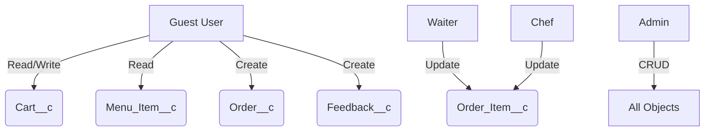

# SmartDine

## 1. Overview

**SmartDine** is a comprehensive restaurant management solution built on **Salesforce**, enabling:

- Contactless QR-based ordering for customers  
- Real-time kitchen workflow management  
- Integrated payment processing  
- Customer feedback collection  
- Centralized analytics for restaurant owners

**Tech Stack:**  
Lightning Web Components (LWC), Apex, Experience Cloud (LWR), SOQL, REST APIs

---

## 2. Key Features

- QR-Based Access: Unique table identification via QR codes  
- Real-Time Order Management: From placement to kitchen to serving  
- Centralized Cart System: Persistent cart using `Cart__c` object  
- Multi-Payment Support: Cash, Card, UPI integration  
- Feedback Collection: Item-level and overall ratings  
- Automated Billing: PDF/email bill generation with feedback  
- Responsive Design: Works on mobile and desktop devices

---

## 3. User Roles & Interfaces

### 3.1 Customer (External User)

**Access:** Via QR code (`?tableId=...`)  
**Workflow:**

- Browse categorized menu  
- Add items to cart (`Cart__c`)  
- Place order (locked after submission)  
- Make payment (Cash/Card/UPI)  
- Submit feedback (ratings and comments)

---

### 3.2 Waiter (Salesforce Mobile App)

**Responsibilities:**

- View prepared items  
- Mark items as "Completed"  
- Monitor table statuses

---

### 3.3 Chef (Salesforce Web Interface)

**Workflow:**

- View active `Order_Item__c` records  
- Filter by table/status  
- Mark items as "Prepared"  
- Notify waiter automatically

---

### 3.4 Admin (Salesforce Web Interface)

**Capabilities:**

- Menu item management (CRUD)  
- Table and customer management  
- View analytics dashboard  
- Moderate feedback  
- Configure system settings

---

## 4. Salesforce Data Model

| Object           | Key Fields                          | Description                          |
|------------------|--------------------------------------|--------------------------------------|
| `Cart__c`        | `Items_JSON__c`, `Status__c`         | Stores cart items pre-order          |
| `Order__c`       | `Table__c`, `Status__c`              | Finalized orders                     |
| `Order_Item__c`  | `Menu_Item__c`, `Status__c`          | Individual items in an order         |
| `Bill__c`        | `Payment_Method__c`, `Total_Amount__c` | Payment information                |
| `Feedback__c`    | `Item_Ratings__c`, `Overall_Rating__c` | Ratings and comments               |
| `Table__c`       | `IsOccupied__c`, `QR_Code_URL__c`    | Physical restaurant tables           |
| `Customer__c`    | `Assigned_Table__c`                  | Guest-to-table assignment            |
| `Menu_Item__c`   | `Category__c`, `Price__c`            | Restaurant menu items                |

---

## 5. Experience Cloud Setup (LWR)

**Configuration:**

- Site Template: LWR  
- Domain: `orgfarm-eb4f2e5f56-dev-ed.develop.my.site.com`  
- Guest Access: Enabled for all customer-facing components

**Key Components:**

- `MenuListLWC`: Dynamic menu display with search  
- `CartLWC`: Real-time cart management  
- `OrderSummaryLWC`: Order review and payment  
- `FeedbackFormLWC`: Post-meal feedback collection

---

## 6. Feedback System

### 6.1 Workflow

After payment, the customer sees a feedback form.  
They can submit:

- Item-level ratings (stored as JSON in `Item_Ratings__c`)  
- Overall experience rating (1–5)  
- Comments

Feedback is linked to both `Bill__c` and `Table__c`.

---

### 6.2 `Feedback__c` Structure

| Field              | Type               | Description                          |
|--------------------|--------------------|--------------------------------------|
| `Bill__c`          | Lookup              | Associated bill                      |
| `Table__c`         | Lookup              | Table where meal was served          |
| `Item_Ratings__c`  | Text Area (Long)    | JSON array of item ratings           |
| `Overall_Rating__c`| Number (1,0)        | Rating for overall experience        |
| `Comments__c`      | Text Area (Long)    | Customer comments                    |
| `Submitted__c`     | Checkbox            | True when feedback submitted         |

---

## 7. Apex Architecture

### Key Apex Classes

**CartController**  
- `getActiveCart()`: Retrieve or create cart for the table  
- `updateCartItems()`: Persist cart changes  
- `checkoutCart()`: Finalize the cart and create an order  

**OrderController**  
- `createOrderWithItems()`: Create order and associated items  
- `updateOrderStatus()`: Update status of orders or items  

**BillController**  
- `generateBill()`: Generate billing record  
- `sendEmailReceipt()`: Send bill via email with feedback summary  

**FeedbackController**  
- `submitFeedback()`: Save submitted feedback  
- `getFeedbackForBill()`: Retrieve feedback for a bill  

**PDFGenerator**  
- `generateBillPDF()`: Create a downloadable bill PDF  
- `attachFeedbackToPDF()`: Include ratings and comments in PDF  

---

## 8. UX Design Principles

### Core Principles

- Mobile-first, responsive design  
- Progressive disclosure of content  
- Real-time updates on actions (e.g., cart updates)  
- Prevention of invalid actions (e.g., editing placed orders)  
- Visual and functional consistency across components

### Key Patterns

- Simple, tab-less navigation  
- Modal dialogs for customer creation and billing  
- Status badges for order items (e.g., Pending, Preparing, Completed)  
- Collapsible sections for menu categories

---

## 9. Pending Enhancements

| Priority | Feature                    | Description                                     |
|----------|----------------------------|-------------------------------------------------|
| High     | PDF Mobile Optimization    | Improve PDF bill appearance on mobile devices   |
| High     | Real-time Updates          | Auto-refresh using CometD or Platform Events    |
| Medium   | Toast Notifications        | Visual confirmation for feedback submission     |
| Medium   | Registered User Accounts   | User login for order history and preferences    |
| Low      | Power BI Integration       | External dashboards for advanced analytics      |
| Low      | Reservation System         | Add table booking capabilities                  |

---

## 10. Deployment Strategy

### User Access Channels

- Customers: Experience Cloud via QR code  
- Waiters: Salesforce Mobile App  
- Chefs/Admins: Salesforce Web Interface

### Permission Model



---

## 11. Technical Highlights

### Notable Implementations

- JSON-based item storage in `Cart__c.Items_JSON__c`  
- Unified status tracking across Order and Order_Item objects  
- Automated freeing of tables after checkout  
- Feedback aggregation at both item and overall levels

### Security Model

- Full CRUD/FLS enforcement in Apex  
- Use of `WITH SECURITY_ENFORCED` in SOQL queries  
- User-mode DML for guest user operations  
- CSRF protection on REST endpoints

---

## 12. QR Integration Details

### QR Code Generation (Apex)

```apex
public static String generateQRCode(Id tableId) {
    String siteUrl = [SELECT UrlPathPrefix FROM Network WHERE Id = :Network.getNetworkId()].UrlPathPrefix;
    String qrData = 'https://' + siteUrl + '/order?tableId=' + tableId;
    return 'https://api.qrserver.com/v1/create-qr-code/?size=200x200&data=' + EncodingUtil.urlEncode(qrData, 'UTF-8');
}
```

### Processing Flow

1. Customer scans QR code  
2. Redirected to Experience Cloud site with `tableId`  
3. Table info fetched using `TableInfoAPI`  
4. Active cart is retrieved or created for session

---

## 13. Analytics Capabilities

### Pre-Built Reports

**Sales Performance**

- Revenue breakdown by category and time  
- Average order value  
- Most popular menu items

**Operational Efficiency**

- Order preparation durations  
- Table turnover rates  
- Waiter performance metrics

**Customer Insights**

- Feedback trend analysis  
- Repeat customer rates  
- Frequently ordered item combinations

---

## 14. Credits

**Project Lead:** Aadarsh Senapati  
**Technologies Used:** Salesforce LWC, Apex, Experience Cloud, SOQL, REST API  
**Acknowledgements:** Salesforce Stack Exchange Community, Trailhead

---
